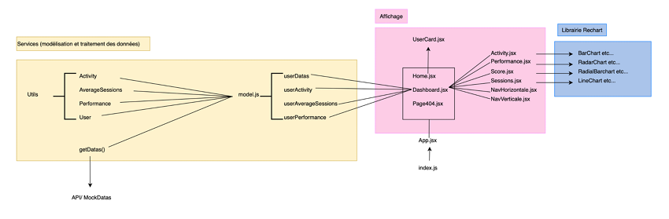

###

# SportSee deployment

###

## Project 12 "SportSee" from React JS Application Developer Training: 

Use an API for a bank user account with React
 
 
 
**Skills developed:**

- Ensuring the data quality of an application
- Develop advanced graphical elements using JavaScript libraries
- Interact with a web service
- Produce technical documentation for an application
   
   
🚨 In order to publish the application online, this version only uses mocked data.
##
To locally install the version using a backend and API calls, click [here](https://github.com/cla31/P12-SportSee) and follow the key steps. 
##
**Code Architecture:** 
 

##
To view the page online click :point_right: [here](https://sportsee-deployment.vercel.app)
##
